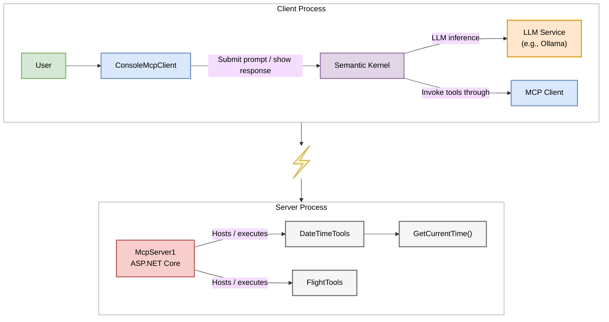

**Workflow Sequence Diagram**

This diagram below shows the step-by-step flow of a request, from the user's prompt to the final answer.
1.	The ConsoleMcpClient starts and fetches the available tools from McpServer1.
2.	It configures Semantic Kernel with these tools.
3.	The user provides a prompt.
4.	Semantic Kernel sends the prompt and tool definitions to the LLM.
5.	The LLM determines a tool is needed and asks the Kernel to execute it.
6.	The Kernel invokes the tool through the MCP client, which calls the McpServer1.
7.	The server runs the tool and returns the result.
8.	The Kernel sends the tool's result back to the LLM, which generates the final human-readable answer.
9.	The client displays the answer to the user.

-----

